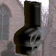
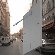
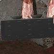
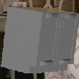
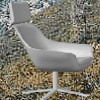
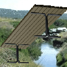
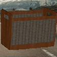

# Flying Furniture

_A small synthetic dataset for Classification and Segmentation._

    

## Introduction

This repository contains the code to create the __Flying Furniture__ dataset. Flying Furniture dataset contains 50,000 synthetically rendered images containing 20 sub-classes (12 classes) of furnitures. Each image contains a single furniture, for random viewpoint (and random truncation, random lighting) with a random background. Additionally, segmentation maps are provided all images, based on the 12 classes. This dataset can be used for 20-way classification or 13-way(including background) segmentation.

The code is provided to help the reader create their own synthetic dataset.

### Flying Furniture dataset:


| Serial No.| Class|Sub-Class| Segmetation-color| Examples  |
| ------------- |-------------| -----|------------- |-------------|
|1| zigzag_chair | chair | (192.0, 0.0, 128.0) |  |
|2| normal_bed | bed | (0.0, 64.0, 0.0) |  |
|3| clock | clock | (192.0, 128.0, 0.0) |  |
|4| desk_cabinet | cabinet | (0.0, 128.0, 0.0) |  |
|5| twodoor_cabinet | cabinet |(0.0, 128.0, 0.0) |  |
|6| lamp | lamp | (64.0, 0.0, 128.0) |  |
|7| swivel_chair | chair | (192.0, 0.0, 128.0) |  |
|8| pool_table | table | (128.0, 128.0, 128.0) |  |
|9| flat_bench | bench | (64.0, 128.0, 128.0) |  |
|10| basket | basket | (192.0, 128.0, 128.0) |  |
|11| straight_chair | chair | (192.0, 0.0, 128.0) |  |
|12| letter_box | mailbox | (0.0, 64.0, 128.0) |  |
|13| birdhouse | birdhouse | (128.0, 0.0, 0.0) |  |
|14| bookshelf | bookshelf |  (128.0, 0.0, 0.0) |  |
|15| lshaped_sofa | sofa | (128.0, 64.0, 0.0) |  |
|16| bunk_bed | bed | (0.0, 64.0, 0.0) |  |
|17| normal_sofa | sofa | (128.0, 64.0, 0.0) |  |
|18| normal_bench | bench | (64.0, 128.0, 128.0) |  |
|19| coffee_table | chair | (128.0, 128.0, 128.0) |  |
|20| dresser_cabinet | cabinet | (0.0, 128.0, 0.0) |  |

 
 
## But why?

I was the Teaching Assistant for [**DS-265: Deep Learning for Computer Vision**](https://val-iisc.github.io/DLCV/) at CDS department ,IISc, Bangalore for the spring semester of 2018. For giving the students a hands-on experience of deep learning, along with my colleague Ram Prabakar, I held a in-class Kaggle competition for the course. To avoid copy-paste of solutions from GitHub, and to make the challenge more intriguing, I created this dataset.  The Kaggle competition [**The Flying Furniture Challenge**](https://www.kaggle.com/c/ffc) was held from February 8th to Februray 19th. For more details on the challenge, check out the link!   

## Instructions

1) First we need to install and download a couple of things:[Shapenet dataset](https://www.shapenet.org/), [SUN dataset](https://groups.csail.mit.edu/vision/SUN/), [Blender](https://www.blender.org/).

2) Add symbolic links for the Shapenet Dataset and SUN dataset in `dataset` folder:
```
ln -s <location-to-shapenet> ./
ln -s <location-to-sun> ./
```

3) Add the `BASE_DIR` in `global_variables.py` file.
```
BASE_DIR = <location-to-this-code>
```
If required, modify the `global_variables.py` file.  This file contains all the useful variables such as saving location etc.

4) First, run `python save_info.py` to save essential information in a dict(`info.npy`) for other files.

5) Now you can run a sequence of files to get the results: 
```
cd render_pipeline
# to run the rendering process
python run_render.py
cd ..
# to process the files: get bounding boxes, segmentation map etc.
python process_images.py
# to get the train-test-split, various text files etc.
python make_train_test_split.py
```

This creates `data/classification/` which contains the classification dataset, and `data/segmentation` which contains the segmentation maps. The folder `meta_files`, contains csv files with meta information about models in [Shapenet dataset](https://www.shapenet.org/). We use this to decide the sub-class of various models. 

The name of the dataset is inspired by the [flying chairs dataset](https://lmb.informatik.uni-freiburg.de/resources/datasets/FlyingChairs.en.html).

** This code can be used to understand the render pipeline in RenderForCNN and adapted likewise for various purposes. **

## Acknowledgement

This code is mostly just a simplified version of [RenderForCNN](https://github.com/ShapeNet/RenderForCNN). I Would like the following:

* Authors of [RenderForCNN](https://github.com/ShapeNet/RenderForCNN): Hao Su, Charles R. Qi, Yangyan Li, Leonidas J. Guibas from Stanford University,
* Creators of [Blender](https://www.blender.org/),
* Members of [Video Analytics Lab, IISc](http://val.serc.iisc.ernet.in/valweb/),
* Creators of [Shapenet dataset](https://www.shapenet.org/),
* Creators of [SUN dataset](https://groups.csail.mit.edu/vision/SUN/). 
